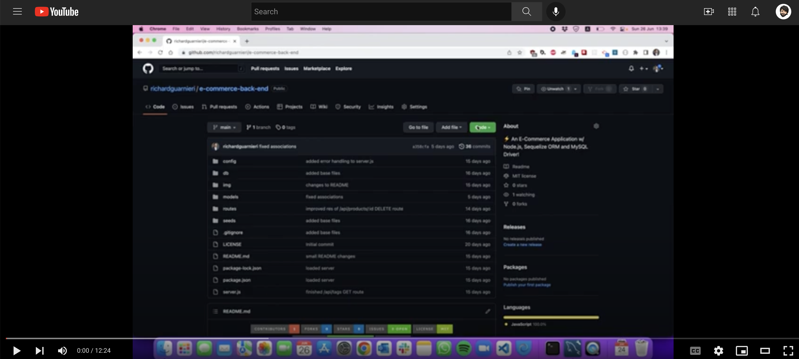

<!-- This template was created following The Markdown Guide - https://www.markdownguide.org/ -->

<!-- If you are editing this README.md on VS Code, please highlight and replace the following keywords enclosed in backticks (``) using:
* MacOS: CMD + Shift + L
* Windows: CRTL + Shift + L

GitHub Username: `richardguarnieri`
GitHub Repository: `e-commerce-back-end`
Your Name: `Richard Guarnieri`
Email: `richard.gm@outlook.com`
LinkedIn Username: `rguarnieri`
Twitter Username: `ric_guarnieri`
Project Title: `E-Commerce Back End`
Project Description: `An E-Commerce Application w/ Node.js, Sequelize ORM and MySQL Driver!`
-->

<!-- Please also update the following links -->
[logo]: ./img/logo.png
[application-image]: ./img/app-image.png

<div id="home"><div> 

<!-- Badges / Shields -->
<!-- These were created using https://shields.io/ - feel free to replace / create yours by modifying links below: -->

<div align="center">
    <a href="https://github.com/richardguarnieri/e-commerce-back-end/graphs/contributors">
        
    <a>
     <a href="https://github.com/richardguarnieri/e-commerce-back-end/network/members">
        
    <a>
     <a href="https://github.com/richardguarnieri/e-commerce-back-end/stargazers">
        
    <a>
     <a href="https://github.com/richardguarnieri/e-commerce-back-end/issues">
        
    <a>
     <a href="https://github.com/richardguarnieri/e-commerce-back-end/blob/main/LICENSE">
        
    <a>
     <a href="https://github.com/richardguarnieri/e-commerce-back-end/commits/main">
        
    <a>
    <a href="https://www.linkedin.com/in/rguarnieri/">
        
    <a>
</div>
<br>


<!-- Header -->

<div align="center">
    <a href="https://github.com/richardguarnieri/e-commerce-back-end">
        
    </a>
    <h1 align="center">E-Commerce Back End</h1>
    <div>
        An E-Commerce Application w/ Node.js, Sequelize ORM and MySQL Driver!
        <br>
        <a href="https://github.com/richardguarnieri/e-commerce-back-end">
            <strong>Explore Documentation</strong>
        </a>
        <br>
        <br>
        <a href="https://github.com/richardguarnieri/e-commerce-back-end">View Demo</a>
        ·
        <a href="https://github.com/richardguarnieri/e-commerce-back-end/issues">Report Bug / Request Feature</a>
    </div>
</div>
<br>


<!-- Table of Contents -->
## Table of Contents
* [The Project](#the-project)
    * [Technology Stack](#technology-stack)
* [Getting Started](#getting-started)
    * [Prerequisites](#prerequisites)
    * [Installation](#installation)
* [How to Use](#how-to-use)
* [Contributing](#contributing)
* [License](#license)
* [Contact](#contact)
* [Miscellaneous](#miscellaneous)
    * [User Story](#user-story)
    * [Acceptance Criteria](#acceptance-criteria)
<br>


<!-- The Project -->
## The Project

![Application Image][application-image]

E-Commerce sales in the US grew 14.2% in 2021 - consumers spent $870.78 billion online with U.S. merchants last year, up from $762.68 billion in 2020, according to Commerce Department data.

Online interactions and business environments have been changing continuously ever since the internet began. E-Commerce's evolution is captivating – and it advances at quicker paces year-over-year.

This is a back end application for an e-commerce site built on Express.js API and uses Sequelize to interact with a MySQL database to perform RESTful CRUD Operations.


<p align="right"> - <a href="#home">Return to Home</a></p>

### Technology Stack
* [JavaScript](https://www.ecma-international.org/publications-and-standards/standards/ecma-262/)
* [Node.js](https://nodejs.org/en/)
* [Express.js](https://expressjs.com/)
* [Sequelize](https://sequelize.org/)
* [MySQL2](https://www.npmjs.com/package/mysql2)
* [Dotenv](https://www.npmjs.com/package/dotenv)

<p align="right"> - <a href="#home">Return to Home</a></p>


<!-- Getting Started -->
## Getting Started
To get started you will need a couple of things - clear explanation of this below:

<p align="right"> - <a href="#home">Return to Home</a></p>

### Prerequisites
[Node.js](https://nodejs.org/en/) as we will need it to install [Sequelize](https://sequelize.org/), [MySQL2](https://www.npmjs.com/package/mysql2), [Express.js](https://expressjs.com/) and [Dotenv](https://www.npmjs.com/package/dotenv) packages to run the application.

We also need to install **MySQL** - links are provided in the next section.

<p align="right"> - <a href="#home">Return to Home</a></p>

### Installation
In order to get started, we must first install [Node.js](https://nodejs.org/en/) - on macOS I prefer to install it using the Homebrew package manager and on Windows using the Node.js homepage download section.

**On macOS:**
1. To install Homebrew on macOS, browse to [Homebrew's official website](https://brew.sh/) and copy the link displayed on the page on the macOS terminal. At the time of writing, this is the command: 
```shell
/bin/bash -c "$(curl -fsSL https://raw.githubusercontent.com/Homebrew/install/HEAD/install.sh)"
```

2. Once Homebrew installation is complete, type the following command to install Node.js and NPM:
```shell
brew install node
```

3. Once the installation finishes, confirm that you successfully installed Node.js by checking its version:
```shell
node -v
```

**On Windows:**
1. In a web browser, navigate to https://nodejs.org/en/download/. Click the Windows Installer button to download the latest default version. At the time of writing, the latest LTS version is 16.15.0.

2. Execute the installer to install Node.js

3. Once the installation finishes, confirm that you successfully installed Node.js by checking its version:
```shell
node -v
```

**MySQL**

After installing Node.js, we then proceed to install MySQL. To do so, please review the following documentation:

Windows: https://dev.mysql.com/doc/refman/8.0/en/windows-installation.html

macOS: https://dev.mysql.com/doc/refman/5.7/en/macos-installation-pkg.html

Preferably, you would also install the MySQL Workbench visual tool. To do so, follow this link:
https://www.mysql.com/products/workbench/

Please ensure **MySQL** is installed correctly! This is a requirement to run the RESTful API and we will be in constant communication with the database to perform CRUD operations.

<p align="right"> - <a href="#home">Return to Home</a></p>


<!-- How to Use -->
## How to Use
First, clone this repo via HTTPS in your local computer - feel free to use any storage destination / folder of your choosing. On macOS / Windows, open the CLI (Command Line Interface) and type the following command (ensure you are located in the exact directory where you want to clone the repo):

```shell
git clone https://github.com/richardguarnieri/e-commerce-back-end.git
```
After the repo has sucessfully cloned, navigate to the repo using the cd (chage directory) command:

```shell
cd e-commerce-back-end/
```
Once inside the e-commerce-back-end directory, install the necessary node pacakges to run the application - in order to do so, pls type on the CLI the following command:

```shell
npm install
```

Above command will install [Sequelize](https://sequelize.org/), [MySQL2](https://www.npmjs.com/package/mysql2), [Express.js](https://expressjs.com/) and [Dotenv](https://www.npmjs.com/package/dotenv) packages along all its dependencies in a newly generated folder within the e-commerce-back-end directory called node_modules/

Once installation finishes, please create an **.env** file in the root directory with the following lines:

```shell
DB_USER='your database user credentials here'
DB_PW='your database password credentials here'
DB_NAME='ecommerce_db'
```

Replace the text in DB_USER and DB_PW with your database credentials. If you did not add a password, leave the DB_PW field blank. Example:

```shell
DB_PW=''
```

After creating the **.env** file in the root directoy, navigate through the **/db/schema.sql** file, open it, copy the code and paste the query in MySQLWorkbench - this will create a new database called **ecommerce_db**.

After creating the database, we need to feed in the tables and values, to do so, run the following command in the terminal:

```shell
npm run seed
```

This will create the tables and fill it with data - after this is done, we are now clear to execute the application. To do so, run the server.js file by typing in the CLI the following command:

```shell
npm start
```

After execution, the app will create a Sequelize connection and an Express.js web server. You will have the following API routes available in your "http://localhost:3001/":

```shell
GET Methods:
localhost:3001/api/categories // find all categories
localhost:3001/api/categories/:id // find one category by its id
localhost:3001/api/products // find all products
localhost:3001/api/products/:id // find one product by its id
localhost:3001/api/tags // find all tags
localhost:3001/api/tags:id // find one tag by its id

POST Methods:
localhost:3001/api/categories // create a new category
localhost:3001/api/products // create a new product
localhost:3001/api/tags // create a new tag

PUT Methods:
localhost:3001/api/categories/:id // update a category by its id value
localhost:3001/api/products/:id // update a product by its id value
localhost:3001/api/tags:id // update a tag by its id value

DELETE Methods:
localhost:3001/api/categories/:id // delete a category by its id value
localhost:3001/api/products/:id // delete a product by its id value
localhost:3001/api/tags:id // delete a tag by its id value
```

The following video walkthrough explains how to use the app and each of its routes:

[](https://youtu.be/zDpSBCxxfSg)

_For more examples, please refer to the [Documentation][documentation-url]._

<p align="right"> - <a href="#home">Return to Home</a></p>


<!-- Contribuiting -->
## Contributing
Contributions are much welcomed! If you have suggestions to make this application better, please fork the repo and create a pull request. 

You can also open an issue [here][github-issues-url] and tag it with the **"enhancement"** label.

<p align="right"> - <a href="#home">Return to Home</a></p>


<!-- License -->
## License
This project is licensed under the terms of the MIT license. 

See `LICENSE` for more information.

<p align="right"> - <a href="#home">Return to Home</a></p>


<!-- Contact -->
## Contact
Richard Guarnieri: richard.gm@outlook.com · LinkedIn: [rguarnieri][linkedin-url] · Twitter: [@ric_guarnieri][twitter-url]

<p align="right"> - <a href="#home">Return to Home</a></p>


<!-- Miscellaneous -->
## Miscellaneous
### User Story
```
AS A manager at an internet retail company
I WANT a back end for my e-commerce website that uses the latest technologies
SO THAT my company can compete with other e-commerce companies
```

<p align="right"> - <a href="#home">Return to Home</a></p>

### Acceptance Criteria
```
GIVEN a functional Express.js API
WHEN I add my database name, MySQL username, and MySQL password to an environment variable file
THEN I am able to connect to a database using Sequelize
WHEN I enter schema and seed commands
THEN a development database is created and is seeded with test data
WHEN I enter the command to invoke the application
THEN my server is started and the Sequelize models are synced to the MySQL database
WHEN I open API GET routes in Insomnia for categories, products, or tags
THEN the data for each of these routes is displayed in a formatted JSON
WHEN I test API POST, PUT, and DELETE routes in Insomnia
THEN I am able to successfully create, update, and delete data in my database
```

<p align="right"> - <a href="#home">Return to Home</a></p>


<!-- References, Links and Images -->
<!-- Badges / Shields Styles -->
[github-contributors-shield]: https://img.shields.io/github/contributors/richardguarnieri/e-commerce-back-end?style=for-the-badge
[github-forks-shield]: https://img.shields.io/github/forks/richardguarnieri/e-commerce-back-end?style=for-the-badge
[github-stars-shield]: https://img.shields.io/github/stars/richardguarnieri/e-commerce-back-end?style=for-the-badge
[github-issues-shield]: https://img.shields.io/github/issues/richardguarnieri/e-commerce-back-end?style=for-the-badge
[github-license-shield]: https://img.shields.io/github/license/richardguarnieri/e-commerce-back-end?style=for-the-badge
[github-last-commit-shield]: https://img.shields.io/github/last-commit/richardguarnieri/e-commerce-back-end?style=for-the-badge
[linkedin-shield]: https://img.shields.io/badge/-LinkedIn-black.svg?style=for-the-badge&logo=linkedin&colorB=555

<!-- Badges / Shields URL -->
[github-contributors-url]: https://github.com/richardguarnieri/e-commerce-back-end/graphs/contributors
[github-forks-url]: https://github.com/richardguarnieri/e-commerce-back-end/network/members
[github-stars-url]: https://github.com/richardguarnieri/e-commerce-back-end/stargazers
[github-issues-url]: https://github.com/richardguarnieri/e-commerce-back-end/issues
[github-license-url]: https://github.com/richardguarnieri/e-commerce-back-end/blob/main/LICENSE
[linkedin-url]: https://linkedin.com/in/rguarnieri

<!-- Non Badge / Shield Reference Links -->
[documentation-url]: https://github.com/richardguarnieri/e-commerce-back-end
[twitter-url]: https://twitter.com/ric_guarnieri